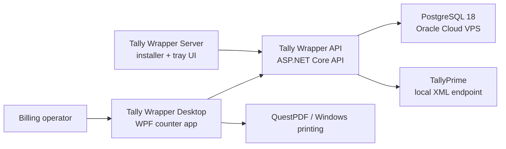

# Tally Wrapper

[](https://dotnet.microsoft.com/)
[](https://www.microsoft.com/windows)
[](https://www.postgresql.org/)
[](https://learn.microsoft.com/dotnet/desktop/wpf/)
[](https://tallysolutions.com/)

Tally Wrapper is a Windows billing system for jewellery showrooms. It combines a WPF counter app, a local ASP.NET Core API, PostgreSQL, QuestPDF printing, and direct TallyPrime XML integration.

The system is designed for operator-controlled billing. Bills are saved locally through the API, printed from the desktop app, and pushed to Tally only when an operator explicitly clicks a push action. There is no background Tally polling, queue worker, or automatic posting loop.

## Contents

- [What It Does](#what-it-does)
- [Architecture](#architecture)
- [Repository Layout](#repository-layout)
- [Prerequisites](#prerequisites)
- [Quick Start](#quick-start)
- [Configuration](#configuration)
- [Running Locally](#running-locally)
- [Publishing EXEs](#publishing-exes)
- [Server Mode Deployment](#server-mode-deployment)
- [Security Model](#security-model)
- [Testing](#testing)
- [Troubleshooting](#troubleshooting)
- [Documentation](#documentation)

## What It Does

Tally Wrapper supports the core workflow for a jewellery billing counter:

| Area | Capabilities |
|---|---|
| Billing | Draft creation, invoice numbering, jewellery line math, GST-inclusive totals, edit/revise/void flows |
| Tally | Synchronous voucher create/alter, master refresh, active company checks, failure reporting |
| Printing | Tax invoice preview, PDF export, printer dispatch, logo/signature/watermark assets, structured print layout designer |
| Operations | Health banners, startup recovery, service tray, logs, database setup, LAN server mode |
| Admin | Passcode unlock, session tokens, bill renumbering, local state overrides, destructive actions |
| Multi-counter | Tally-server API service with trusted LAN workstations |

## Architecture

The app is intentionally split into a small number of clear runtime pieces:



### Runtime Shapes

| Mode | Shape | Use case |
|---|---|---|
| `LocalEmbedded` | Desktop starts and supervises a local API child process | Single-machine pilot or one counter with Tally on the same PC |
| `Server` | API runs as a Windows Service on the Tally server; desktops connect over LAN | Multi-counter showroom deployment |

The API owns all durable business state. The Desktop is a rich client; it does not maintain a separate local billing database.

### Tally Integration Contract

Tally communication is synchronous and operator-initiated:

- Save Bill creates/updates the bill in PostgreSQL only.
- Push / Retry / Repost sends one voucher HTTP request to Tally and returns `posted`, a definite `failed`, or `reconciliation_required` when the write outcome is uncertain.
- Refresh from Tally fetches masters on demand and writes the snapshot.
- If the API crashes while a bill is in `posting`, startup recovery moves it to `reconciliation_required`; the operator verifies Tally before marking it posted or pending.

See [docs/05_tally_integration_contract.md](docs/05_tally_integration_contract.md) for the full contract.

## Repository Layout

```text
src/
  ShowroomBilling.Api/          ASP.NET Core API, auth, controllers, runtime setup
  ShowroomBilling.Desktop/      WPF desktop app, view models, views, process supervision
  ShowroomBilling.ServerTray/   Windows tray installer/controller for server mode
  ShowroomBilling.Application/  Application contracts and business services
  ShowroomBilling.Infrastructure/ EF Core, PostgreSQL, Tally XML, persistence workflows
  ShowroomBilling.Contracts/    Shared DTOs between API and desktop
  ShowroomBilling.Printing/     QuestPDF invoice rendering

tests/
  ShowroomBilling.Tests/         API, infrastructure, contracts, printing tests
  ShowroomBilling.Desktop.Tests/ ViewModel and desktop workflow tests

tools/
  publish-prod.ps1
  publish-server-tray.ps1
  publish-server-api.ps1
  install-server-api-service.ps1
  uninstall-server-api-service.ps1

docs/
  Architecture, API, database, deployment, printing, settings, and UI references
```

## Prerequisites

Development currently targets Windows because the desktop host is WPF.

| Requirement | Notes |
|---|---|
| Windows 10/11 | Required for WPF, printing, DPAPI, and Windows Service/server tray behavior |
| .NET SDK `10.0.202` | Pinned by [global.json](global.json) |
| PostgreSQL 18 | Required for production, local development, and the relational test harness |
| TallyPrime | Required for real posting and master refresh workflows |
| PowerShell | Required for publish and server install scripts |

Optional:

- Docker Desktop for the local Postgres fallback.
- VS Code with the checked-in launch/tasks configuration.

## Quick Start

Clone and build:

```powershell
git clone <repo-url>
cd tally-wrapper

dotnet restore ShowroomBilling.sln
dotnet build ShowroomBilling.sln
dotnet test --solution ShowroomBilling.sln
```

Start a local Postgres fallback:

```powershell
docker compose -f docker-compose.dev.yml up -d
```

The local Compose image is PostgreSQL 18. Existing PostgreSQL 17 volumes require dump/restore or intentional replacement before first use; see [DEV_SETUP.md](DEV_SETUP.md#database).

Run the API:

```powershell
dotnet run --project src/ShowroomBilling.Api
```

Run the desktop app:

```powershell
$env:DOTNET_ENVIRONMENT = "Development"
dotnet run --project src/ShowroomBilling.Desktop
```

Development API defaults to:

- Swagger: `http://localhost:5108/swagger`
- Liveness: `http://localhost:5108/api/health/live`
- Runtime health: `http://localhost:5108/api/runtime/health`

## Configuration

### Database Connection

Real connection strings are not committed. Keep them in one of these private locations:

- OpenBao KV v2 at `kv/Postgres/apps/tally_wrapper/prod` (canonical production secret; authoritative structured fields plus a synchronized `connection_string`)
- OpenBao KV v2 at `kv/Postgres/apps/tally_wrapper_test/dev`, key `connection_string` (persistent Coolify test environment)
- `src/ShowroomBilling.Api/appsettings.Development.json`
- `src/ShowroomBilling.Api/appsettings.Production.json`
- user secrets
- local environment variables (`SHOWROOM_BILLING_POSTGRES` is the API's explicit database override)
- the in-app DPAPI-protected database override

The safe placeholder in `src/ShowroomBilling.Api/appsettings.json` points to local Postgres:

```text
Host=localhost;Port=5432;Database=tally_wrapper;Username=postgres;Password=postgres
```

Production uses PostgreSQL 18 hosted on an Oracle Cloud Infrastructure VPS. The OpenBao secret at `kv/Postgres/apps/tally_wrapper/prod` is the source of truth: its structured connection fields are authoritative and `connection_string` is the synchronized Npgsql form used for runtime injection and EF migrations. The application does not read OpenBao directly; an authorized operator retrieves the derived value with the native `bao` CLI and supplies it through the server tray or another private runtime configuration source. Never commit the credential. See [PostgreSQL deployment](docs/11_deployment_and_ops.md#4-postgresql-deployment) for the OpenBao workflow and the network, TLS, backup, and maintenance responsibilities of the self-hosted database.

The persistent test deployment uses `tally_wrapper_test` inside the same Coolify `shared-postgres` PostgreSQL 18 cluster and connects through PgBouncer; it is not a separate database server. Its OpenBao path, network attachment, and role contract are documented in [Development Setup](DEV_SETUP.md#shared-persistent-test-database).

Manual migration command:

```powershell
dotnet ef database update `
  --project src/ShowroomBilling.Infrastructure `
  --startup-project src/ShowroomBilling.Api `
  --connection "<postgres-connection-string>"
```

Always pass `--connection` when targeting a managed or production database. Do not rely on environment-name resolution for migrations.

### Database Identity Marker

The app uses a DB-owned identity marker to catch accidental environment mixups. After migrations, set one marker per database:

```sql
insert into public.database_identity (key, value, updated_at_utc)
values ('environment', 'DEV', current_timestamp)
on conflict (key) do update
set value = excluded.value,
    updated_at_utc = excluded.updated_at_utc;
```

Use `PROD` for production. The Desktop status bar displays `DB DEV`, `DB PROD`, `DB UNSET`, or a mismatch warning.

### Tally Connection

Tally host, port, active company, ledgers, voucher types, and stock mappings are backend-owned settings. Operators configure them through the Desktop Settings screen. Tally calls are made by the API process, so in server mode TallyPrime must be reachable from the Tally server machine.

## Running Locally

### VS Code

The repository includes VS Code launch/tasks files:

- [`.vscode/launch.json`](.vscode/launch.json)
- [`.vscode/tasks.json`](.vscode/tasks.json)

Recommended debug target:

```text
Desktop + API
```

This starts the API in Development mode on `127.0.0.1:5108` and then starts the Desktop without spawning a second API.

### API Only

```powershell
$env:ASPNETCORE_ENVIRONMENT = "Development"
$env:DOTNET_ENVIRONMENT = "Development"
dotnet run --project src/ShowroomBilling.Api --urls http://127.0.0.1:5108
```

### Desktop Only

```powershell
$env:DOTNET_ENVIRONMENT = "Development"
dotnet run --project src/ShowroomBilling.Desktop
```

By default the Desktop supervises the API child process. To run against an already-started API:

```powershell
$env:SHOWROOM_DESKTOP_ChildProcesses__Api__Enabled = "false"
dotnet run --project src/ShowroomBilling.Desktop
```

## Publishing EXEs

The publish scripts create self-contained Windows artifacts under `publish/`.

### Desktop Production EXE

```powershell
.\tools\publish-prod.ps1
```

Output:

```text
publish\prod\TallyWrapper.exe
```

The desktop artifact embeds a sanitized API payload. Production database credentials are not embedded.

### Server Installer / Tray EXE

```powershell
.\tools\publish-server-tray.ps1
```

Output:

```text
publish\server\TallyWrapper.Server.exe
```

This one-file EXE embeds the API service binary and installs/repairs the server-mode Windows Service.

### Standalone Server API EXE

```powershell
.\tools\publish-server-api.ps1
```

Output:

```text
publish\server\api\TallyWrapper.Api.exe
```

Use this when you need the raw API service binary without the tray installer wrapper.

## Server Mode Deployment

Server mode is for a multi-counter showroom where TallyPrime runs on one server machine.

1. Publish the server installer:

   ```powershell
   .\tools\publish-server-tray.ps1
   ```

2. Copy `publish\server\TallyWrapper.Server.exe` to the Tally server.

3. Run it on the Tally server.

4. On first run, enter the trusted LAN CIDR for billing workstations, for example:

   ```text
   192.168.1.0/24
   ```

5. The installer:

   - extracts the API service binary to `C:\ProgramData\ShowroomBilling\bin`
   - installs the Tally Wrapper API Windows Service
   - configures the service for `http://0.0.0.0:5107`
   - creates a firewall rule scoped to the trusted LAN CIDR
   - creates `C:\ProgramData\ShowroomBilling\maintenance_token.txt`
   - registers the tray companion at user login
   - starts the API service

6. Configure each workstation from:

   ```text
   Billing -> Settings -> Database -> API Connection Mode
   ```

7. Choose `Server`, enter:

   ```text
   http://<tally-server>:5107
   ```

8. Save and restart the Desktop.

The server tray dashboard can install/repair, start/stop/restart the API service, test/save database settings, open logs, show connected clients, and copy the workstation URL. Exiting the tray stops the API service first.

## Security Model

This project is built for a trusted showroom LAN, not internet exposure.

| Layer | Behavior |
|---|---|
| Device token | In `LocalEmbedded` mode, mutating API calls require `X-Device-Token`, a random local secret shared by Desktop and API |
| Trusted LAN | In server mode, normal workstation writes are accepted from configured CIDRs and matching firewall scope |
| Admin token | Admin-only actions require `X-Admin-Token`, issued after passcode unlock and expiring after 30 minutes |
| Maintenance token | Server tray DB maintenance uses a localhost-only `X-Maintenance-Token` file under server app data |
| Database secrets | Local overrides are DPAPI-protected; production credentials are not committed or embedded in published desktop artifacts |
| Read endpoints | Business read endpoints are intentionally unauthenticated for the trusted LAN deployment model |

Important deployment notes:

- Do not expose the Tally Wrapper API directly to the internet.
- Keep the trusted CIDR as narrow as practical.
- Admin passcode setup is loopback-only in server mode until configured.
- DB override metadata, DB bootstrap, DB test, and maintenance endpoints are loopback-only in server mode.
- Keep real `appsettings.Development.json` and `appsettings.Production.json` ignored and local.
- Do not publish or zip `bin/`, `obj/`, `publish/`, `.env`, logs, or local appsettings files.

## Testing

Run the full suite:

```powershell
dotnet test --solution ShowroomBilling.sln
```

Run formatting, warning, dependency, and coverage gates:

```powershell
dotnet list ShowroomBilling.sln package --vulnerable --include-transitive
dotnet format style ShowroomBilling.sln --verify-no-changes --no-restore
dotnet build ShowroomBilling.sln --configuration Release --no-restore -warnaserror
.\tools\Test-Coverage.ps1 -MinimumLinePercent 27 -NoBuild
```

Run API contract tests only:

```powershell
dotnet test --project tests/ShowroomBilling.Tests/ShowroomBilling.Tests.csproj --filter "FullyQualifiedName~Contracts"
```

Run the opt-in Postgres integration tests, which require a local Docker endpoint
reachable by Testcontainers or an explicit Postgres test connection string:

```powershell
.\tools\run-postgres-tests.ps1
```

The script starts a temporary `postgres:18` container on the configured Docker
context, runs `Category=Postgres`, and stops the container afterward. To run the
tests against an already-running remote Postgres instance instead:

```powershell
$env:SHOWROOM_BILLING_RUN_POSTGRES_TESTS='1'
$env:SHOWROOM_BILLING_POSTGRES_TEST_CONNECTION='Host=<host>;Port=<port>;Database=postgres;Username=postgres;Password=postgres'
dotnet test --project tests/ShowroomBilling.Tests/ShowroomBilling.Tests.csproj --filter "Category=Postgres"
```

What the tests cover:

- bill state workflows
- numbering/idempotency shape
- admin unlock behavior
- API contract shape
- Tally XML voucher generation
- database configuration masking/bootstrap behavior
- WPF ViewModel workflows
- printing/rendering helpers

The test DB provider is EF Core InMemory for most DB-backed unit tests. It validates behavior shape, not Postgres locking, unique-index enforcement, or real race semantics. CI therefore runs `Category=Postgres` separately against PostgreSQL 18, matching production. That job is required for numbering, locking, conditional-transition, migration, or unique-index changes.

The persistent `tally_wrapper_test` deployment database is not the connection for this harness: the fixture requires permission to create and drop `tw_test_<guid>` databases, while the persistent API role is intentionally restricted to its one PgBouncer mapping. See [Development Setup](DEV_SETUP.md#shared-persistent-test-database).

## Troubleshooting

| Symptom | Likely Cause | Fix |
|---|---|---|
| Build fails copying Desktop DLLs | Desktop EXE is still running | Close `TallyWrapper.exe` / the Desktop process and rebuild |
| API starts but DB is not ready | Missing or invalid Postgres connection string | Configure DB from Settings or server tray, then restart API |
| Desktop says cloud/API down | API child process not started or wrong port | Check `%APPDATA%\ShowroomBilling\logs` and `ChildProcesses` settings |
| Tally push is blocked, fails, or needs reconciliation | TallyPrime closed, wrong company open, business XML rejection, or the write response was lost | Preflight blocks leave state unchanged; definite rejections can be retried after correction. For `reconciliation_required`, verify the voucher in Tally and use admin Mark as Pushed or Mark as Pending before another push. |
| Workstation cannot reach server | Firewall/CIDR/API URL mismatch | Re-run server installer and verify `http://<server>:5107/api/health/live` |
| Admin action returns 401 | Admin token expired or not unlocked | Press `~` in Desktop and unlock again |
| Server tray DB save fails | Maintenance token missing or API not running locally | Run Install / Repair Server from the tray dashboard |

## Documentation

The detailed specs live in [docs/](docs/README.md):

- [Bill state machine](docs/03_bill_state_machine.md)
- [Numbering and idempotency](docs/04_numbering_and_idempotency.md)
- [Tally integration contract](docs/05_tally_integration_contract.md)
- [Tally XML golden path](docs/06_tally_xml_golden_path.md)
- [Printing spec](docs/07_printing_spec.md)
- [Settings catalog](docs/08_settings_catalog.md)
- [API spec](docs/09_api_spec.md)
- [Database schema](docs/10_database_schema.md)
- [Deployment and operations](docs/11_deployment_and_ops.md)
- [Settings storage contract](docs/14_settings_storage_contract.md)
- [UI design reference](docs/15_ui_design_reference.md)
- [Synthetic batch data](docs/17_synthetic_batch.md)

## Public Repo Hygiene

Before making a fork or release public:

```powershell
gitleaks detect --source . --redact
git status --ignored --short
```

Expected private local files include ignored API environment settings. They should never be committed:

```text
src/ShowroomBilling.Api/appsettings.Development.json
src/ShowroomBilling.Api/appsettings.Production.json
```

The publish output under `publish/` is intentionally ignored.

## License

No open-source license file is currently included. Add a `LICENSE` file before accepting external use or contributions.
